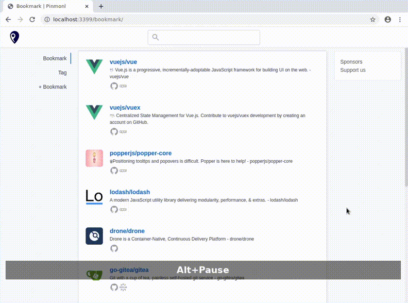

# Pinmonl

## What is Pinmonl
A bookmark manager for developers:
- Shows package status and statistics, e.g. GitHub star, list of versions/tags.
- Share a list of bookmarks, which may be an **awesome** list replacement.
- Bookmark tagging
- Tracking free and Ad. free

Pinmonl is still in the development stage.

## Future Plan

Currently, Pinmonl supports only single user mode and sqlite3 for database.

##### Clients (to be developed)
- Mobile apps
- Browser extension
- CLI

## Get started

#### Docker

`docker run -p 3399:3399 -v /opt/pinmonl:/pinmonl pinmonl/pinmonl`

## Support the project

[Buy me a coffee](https://www.buymeacoffee.com/pinmonl)

[Patreon](https://patreon.com/pinmonl)

Pull requests are welcome.

## License
MIT License.
